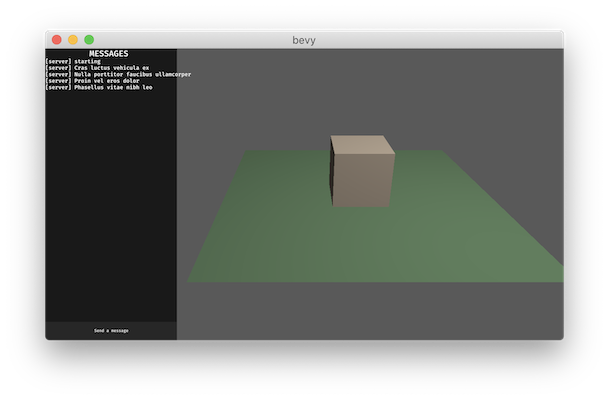

# Bevy Prototype Networking Laminar Plugin

[](https://crates.io/crates/bevy_prototype_networking_laminar)
[](https://opensource.org/licenses/MIT)

**Warning: This is a prototype and not ready for production use**

This is a prototype of a networking crate for [`bevy`](https://github.com/bevyengine/bevy). This create provides a low-level networking plugin built on top of [`laminar`](https://github.com/amethyst/laminar), which adds some simple reliability, ordering, and virtual connection options on top of a UDP socket.

## Getting Started

1. Add `bevy_prototype_networking_laminar` to `Cargo.toml`

```
[dependencies]
bevy = "0.1"
bevy_prototype_networking_laminar = "0.1"
```

2. Add the NetworkPlugin to your `bevy` app setup

```
use bevy_prototype_networking_laminar::NetworkingPlugin;

...

app
  .add_default_plugins()
> .add_plugin(NetworkingPlugin)
  .add_system(...)
```

3. Use the NetworkResource to bind to a socket and send/broadcast messages

```
fn startup_system(net: ResMut<NetworkResource>) {
  net.bind("127.0.0.1:12350").unwrap();
}

fn greeting_system(net: Res<NetworkResource>) {
  net.broadcast(b"How is everybody?", NetworkDelivery::ReliableSequenced(Some(1)));
}
```

4. Listen for `NetworkEvent`s to receive incoming messages

```
#[derive(Default)]
struct NetworkListenerState {
    network_events: EventReader<NetworkEvent>,
}

App::build()
        .add_default_plugins()
        .add_plugin(NetworkingPlugin)
      > .init_resource::<NetworkListenerState>()
      > .add_system(print_network_events.system())
        .run();

fn print_network_events(
    mut state: ResMut<NetworkListenerState>,
    network_events: Res<Events<NetworkEvent>>,
) {
    for event in state.network_events.iter(&network_events) {
        println!("Received a NetworkEvent: {:?}", event);
    }
}
```

## Examples

### testbed

The testbed is a simple project that provides a more comprehensive example of using `bevy_prototype_networking_laminar`.



The testbed is also is intended to serve as a testbed for any other networking prototypes or attempts. All interaction with `bevy_prototype_networking_laminar` is contained to `examples/testbed/net/prototype.rs`. Using the testbed with a different networking plugin should be as simple as updating `prototype.rs` to interact with the other networking plugin. Contributions to the testbed to improve the code quality, or make the testbed more comprehensive by adding other prototypical network interactions are welcome.

- `cargo run --example testbed -- -s 127.0.0.1:12540` to start a server
- `cargo run --example testbed -- -c 127.0.0.1:12541 127.0.0.1:12540 foo` to start a client named `foo` connecting to the server

#### Server

When on the server, you:

- can control the position of the cube with `WASD`
- can click the "send a message" button to add random message to the `MESSAGES` list

#### Client

When on the client, you:

- cannot control the position of the cube
- the cube's position should be syncrhonized with the server
- you can click the "send a message" button to add a random message to the `MESSAGES` list
- the `MESSAGES` list is syncrhonized with the server.

### simple

The simple example shows a very bare bones `bevy` application that will send messages back and forth.

- `cargo run --example simple -- -s` start a server
- `cargo run --example simple -- -c` start a client

```
Network Event: Message(Connection { addr: V4(127.0.0.1:12351), socket: SocketHandle { identifier: 0 } }, b"How are things over there?")
Network Event: Connected(Connection { addr: V4(127.0.0.1:12351), socket: SocketHandle { identifier: 0 } })
Network Event: Disconnected(Connection { addr: V4(127.0.0.1:12351), socket: SocketHandle { identifier: 0 } })
Network Event: Message(Connection { addr: V4(127.0.0.1:12351), socket: SocketHandle { identifier: 0 } }, b"How are things over there?")
Network Event: Connected(Connection { addr: V4(127.0.0.1:12351), socket: SocketHandle { identifier: 0 } })
Network Event: Disconnected(Connection { addr: V4(127.0.0.1:12351), socket: SocketHandle { identifier: 0 } })
```

### multisocket

This shows the ability to bind to multiple sockets.

```
$ cargo run --example multisocket
[SERVER] ---> "How are things?"
         ---> [CLIENT] "How are things?"

[CLIENT] ---> "Good. Thanks!"
         ---> [SERVER] "Good. Thanks!"

[SERVER] ---> "How are things?"
         ---> [CLIENT] "How are things?"
```

## Future Work

The current prototype implementation is extremely rough and early. The current work is mostly about exploring to discover a Network Plugin API that fits the bevy design. Listed here is the current low-hanging fruit for improving this prototype:

- **[#1 Improve error handling](https://github.com/ncallaway/bevy_prototype_networking_laminar/issues/1)**: Currently errors are resolved through `.unwrap()`, `.expect()`, `.panic()` or silently being dropped. The error handling should be cleaned up throughout the plugin, with a clean presentation of errors to the caller.
- **[#2 Multiple sockets](https://github.com/ncallaway/bevy_prototype_networking_laminar/issues/2)**: The prototype currently only allows a single socket, but was designed to easily allow for multiple sockets.
- **[#3 Closing sockets](https://github.com/ncallaway/bevy_prototype_networking_laminar/issues/3)**: The prototype right now doesn't have the ability to manually close a socket. Sockets are closed when the application exists. Add the functionality to manually close a socket.
- **Improve testbed**: The testbed has a number of areas that could be improved
  - **Repository split**: If other projects have interest in using the testbed, split it out into it's own create/repository.
  - **[#4 Code cleanup: net/prototype interface](https://github.com/ncallaway/bevy_prototype_networking_laminar/issues/4)**: The testbed has some rough areas in the split between the `net/mod.rs` and `net/prototype.rs`. Consider cleaning up this interface to make it cleaner to implement a plugin integration
  - **[#5 Code cleanup: Rename Messages](https://github.com/ncallaway/bevy_prototype_networking_laminar/issues/5)**: For a networking testbed, having a domain entity called `Message` is unreasonably burdensom. Rename these to something that doesn't have a networking connotation.
  - **[#6 Code cleanup: Message sync](https://github.com/ncallaway/bevy_prototype_networking_laminar/issues/6)**: The messages are currently fully serialized whenever a message is changed. Clean this up to be a better representation of the desired sync model so that the server only sends the changes on a `Reliable` channel, and the Client can request the full list of messages when they connect, or need to reset their state.
  - **Explore additional prototypical network interactions**: The server sync'd cube example relies on there being a single cube. Consider introducing something that has multiple copies being sync'd to demonstrate sharing stable IDs across the network. Find other ways to expand the testbed to be more representative of the needs of real games.
- **Explore additional useful networking features**: `amethyst-network` exposes a `network simulation time`, which helps synchornize time and track `frame lag` when sending network messages over the system. Explore this concept, and other common networking tasks that would be useful in a low-level networking plugin.
- **Explore shared transport API**: Explore sharing a similar API surface with other Networking Plugins (or integrating other transports into this plugin), so that callers can easily switch between UDP, TCP, Laminar, WebRTC, Naia, etc.

## ACKs

- Thanks first of all to the amethyst team for `laminar`
- Thanks again to the amethyst team for `amethyst-network`

## License

Licesened under the [MIT license](https://opensource.org/licenses/MIT).
